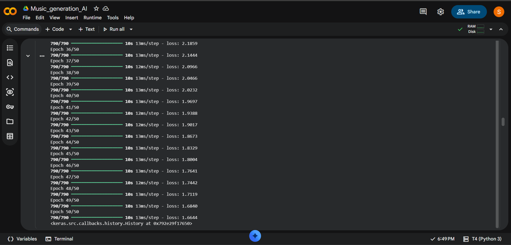
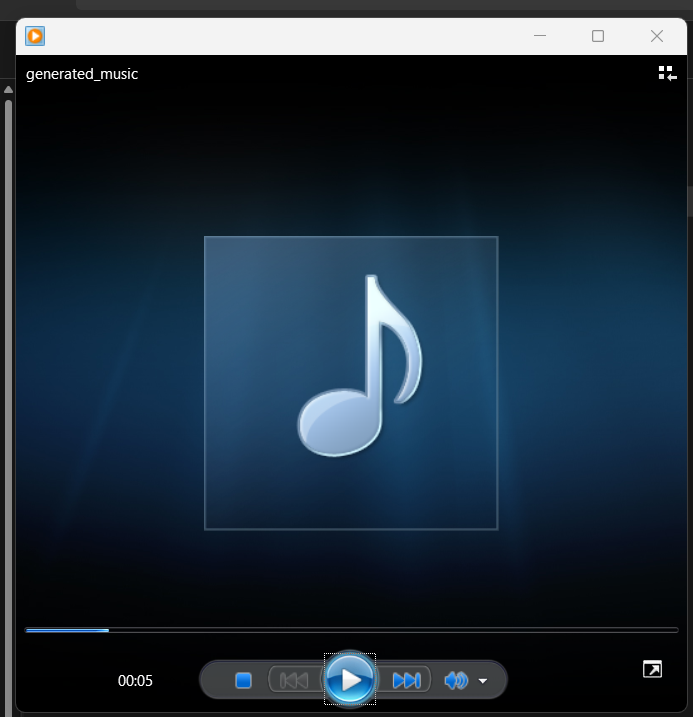
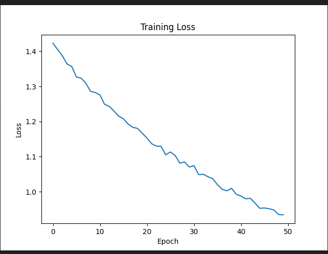

# 🎵 AI Music Generation using LSTM

## Project Overview
This project generates musical note sequences using a Long Short-Term Memory (LSTM) neural network trained on MIDI music data. The model learns patterns from existing music and creates new melodies automatically.

## Features
- MIDI file preprocessing using Music21
- Note sequence extraction
- LSTM-based deep learning model
- Automatic music generation
- Export generated music as MIDI files

## Technologies Used
- Python
- TensorFlow / Keras
- Music21
- NumPy
- Google Colab

## Project Workflow
1. Collect MIDI music files.
2. Extract notes and chords using Music21.
3. Convert notes into numerical sequences.
4. Train an LSTM neural network.
5. Generate new note sequences.
6. Convert generated notes back into MIDI format.

## Model Architecture
- LSTM Layers
- Dropout Layers
- Dense Output Layer
- Softmax Activation

## Results
The trained model successfully generates new musical compositions based on learned musical patterns from the training dataset.

## How to Run
1. Install required libraries:
   pip install -r requirements.txt

2. Open the notebook in Google Colab.

3. Run all cells sequentially.

4. Generate new music and download the output MIDI file.

## Future Improvements
- Train on larger datasets
- Support multiple music genres
- Deploy as a web application
- Add real-time music generation
- # AI Music Generation using LSTM

## Project Overview
This project generates music using an LSTM neural network trained on MIDI files.

## Technologies Used
- Python
- TensorFlow
- Keras
- Music21

## Project Screenshots

## Project Demo

### Model Trained output

### Training Loss Graph

## Generated Output
The model generates MIDI music files based on learned note patterns.

